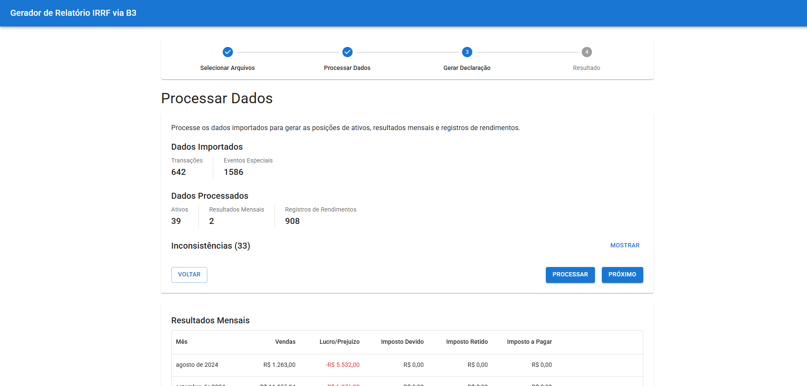
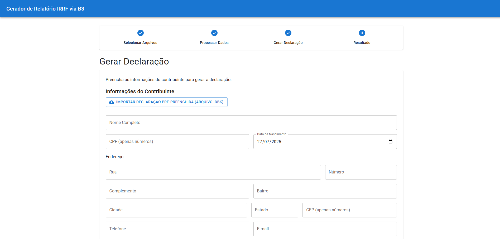
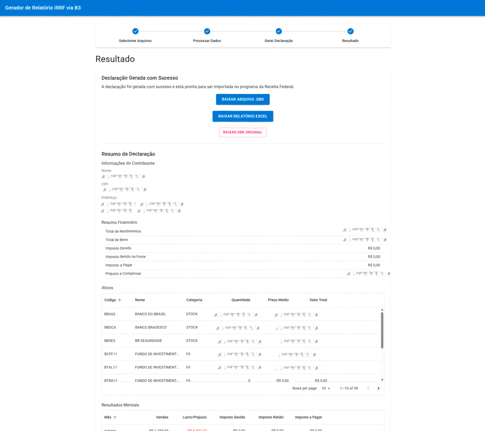

# Gerador de Declaração IRPF para Investimentos na B3

[](https://opensource.org/licenses/MIT)

O **Gerador de Declaração IRPF para Investimentos na B3** é uma aplicação web de código aberto que simplifica a vida dos investidores brasileiros. A ferramenta automatiza a geração de informações para a Declaração de Imposto de Renda de Pessoa Física (DIRPF) a partir dos extratos de negociação e movimentação fornecidos pela B3.

**Aviso Importante:** Esta é uma ferramenta de auxílio e não substitui a consultoria de um profissional de contabilidade e não garante que tudo esta 100% correto, qualquer PullRequest de contribuição será bem-vinda. Os cálculos são baseados nas informações fornecidas nos extratos da B3 e nas regras de tributação vigentes. Verifique sempre os dados gerados antes de enviar sua declaração.

Caso queira contribuir e gosta desse universo de IA, disponibilizamos o arquivo [documentation\INPUTS-TO-IA.txt](./documentation/INPUTS-TO-IA.txt) com um contexto informativo inicial da aplicação, para que possa ser utilizado com ferramentas de IA.


### Cálculo para eventos especiais:

Infelizmente o Portal B3 não informa datas de eventos especiais, eles sendo Bonificação, Desdobramento, Grupamento e Conversões. Para contornar essa falta de dados, foram criados arquivos com esses valores preenchidos manualmente em [src\infrastructure\data](./src/infrastructure/data).


### Arquivos de entrada e saída

A aplicação esta preparada para receber os arquivos Excel do Portal B3, mas também aceita arquivos JSON (o que facilita os testes unitários).

O exemplo dos arquivos de entrada e saída podem ser encontrados em [documentation\example-b3-files](./documentation/example-b3-files/)


### Template do arquivo de saída .DBK

A receita federal divulga os manuais abaixo detalhando o arquivo de template oficial suportado pelo programa: [https://www.gov.br/receitafederal/pt-br/centrais-de-conteudo/publicacoes/documentos-tecnicos/dirpf](https://www.gov.br/receitafederal/pt-br/centrais-de-conteudo/publicacoes/documentos-tecnicos/dirpf).

Atualmente tempos suporte ao último template disponível (2023) através dessas classes: [src/infrastructure/adapters/LayoutDBK2025/](./src/infrastructure/adapters/LayoutDBK2025/).


### Teste unitários

Para trazer maior segurança nos dados gerados com base nos arquivos de entrada, é possível baixar os arquivos no Portal B3 em Excel e converter para JSON, substituindo o conteúdo dos arquivos [documentation\example-b3-files\movimentacao-exemplo.json](./documentation/example-b3-files/movimentacao-exemplo.json) e [documentation\example-b3-files\negociacao-exemplo.json](./documentation/example-b3-files/negociacao-exemplo.json), execute rodando o comando `npm run test`. Dessa forma, serão gerados arquivos de teste unitário para cada um dos seu ativos (O ano de 2024 esta fixo no código, então os testes serão focados neste ano, mas fique a vontade para alterar ou até mesmo deixar dinâmico) e comparar os dados gerados com alguma plataforma de acompanhamento de ativos.

---

## ✨ Core Features

-   **Importação de Arquivos da B3:** Faça o upload dos seus extratos de negociação e movimentação de custódia em formato `.xlsx`.
-   **Importação de Arquivo .DBK:** Importe um arquivo `.DBK` de uma declaração anterior para preencher automaticamente os dados do contribuinte, agilizando o processo.
-   **Processamento de Ativos:** A aplicação calcula o preço médio de compra, o resultado de vendas (lucro/prejuízo), e registra proventos como dividendos e juros sobre capital próprio.
-   **Tratamento de Eventos Especiais:** Lida com desdobramentos (splits), grupamentos (inplits) e bonificações.
-   **Geração de Relatórios:** Visualize um relatório completo com todas as informações necessárias para a sua declaração.
-   **Exportação para .DBK:** Gere um arquivo `.DBK` consolidado, pronto para ser importado no programa oficial da Receita Federal, preenchendo automaticamente os campos da sua declaração.
-   **Privacidade Total:** Todo o processamento é feito localmente no seu navegador. Seus dados financeiros nunca saem do seu computador.

---

## 🚀 Tech Stack & Arquitetura

A aplicação é construída com tecnologias modernas e segue os princípios da **Arquitetura Hexagonal (Ports and Adapters)** para garantir um código desacoplado, testável e de fácil manutenção.

-   **Frontend:** [React](https://react.dev/), [TypeScript](https://www.typescriptlang.org/), [Vite](https://vitejs.dev/), [Material-UI](https://mui.com/)
-   **Gerenciamento de Estado:** React Context API
-   **Armazenamento Local:** [IndexedDB](https://developer.mozilla.org/en-US/docs/Web/API/IndexedDB_API) para persistir os dados da sessão no navegador.
-   **Manipulação de Planilhas:** [SheetJS (xlsx)](https://sheetjs.com/)
-   **Testes:** [Jest](https://jestjs.io/), [React Testing Library](https://testing-library.com/docs/react-testing-library/intro/)

A **Arquitetura Hexagonal** isola a lógica de negócio (domínio) das dependências externas (infraestrutura e UI). Para uma explicação detalhada, consulte nossa **[Documentação de Arquitetura](./documentation/architecture/01-visao-geral.md)**.

---

## 🏁 Getting Started

Siga os passos abaixo para configurar e executar o projeto localmente.

### Pré-requisitos

-   [Node.js](https://nodejs.org/) (versão 18 ou superior)
-   [npm](https://www.npmjs.com/) (geralmente vem com o Node.js)
-   [Python](https://www.python.org/) (necessário para executar o script de geração de testes)

### Instalação

1.  **Clone o repositório:**
    ```bash
    git clone https://github.com/JulioCesar82/gerar-imposto-de-renda.git
    cd gerar-imposto-de-renda
    ```

2.  **Instale as dependências:**
    ```bash
    npm install -f
    ```

3.  **Opcional: Configure as Variáveis de Ambiente:**
    
    **Aviso:** Você pode manipular o arquivo [src\infrastructure\data](./src/infrastructure/data) caso prefira ter dados estáticos.

    Crie um arquivo chamado `.env` na raiz do projeto, copie o conteúdo de `.env.example` e adicione seu token da API [Brapi](https://brapi.dev/).
    ```
    # .env
    REACT_APP_BRAPI_TOKEN=SEU_TOKEN_DA_BRAPI_AQUI
    ```
    *O token da Brapi é usado para buscar informações adicionais sobre os ativos, como CNPJs.*

### Executando a Aplicação

Para iniciar o servidor de desenvolvimento, execute:

```bash
npm start
```

A aplicação estará disponível em `http://localhost:3000`.

---

## 📋 Como Usar

1.  **Obtenha seus Extratos da B3:**
    Antes de começar, você precisará baixar seus extratos de negociação e movimentação. Preparamos um guia detalhado para ajudá-lo.
    -   **[Guia Completo: Como Baixar os Extratos da B3](./PORTAL_B3.md)**

2.  **Importe os Arquivos:**
    Com a aplicação aberta, vá para a página de upload e importe os dois arquivos `.xlsx` que você baixou.

3.  **Processe e Gere a Declaração:**
    Siga as instruções na tela para processar os dados e, ao final, gerar o arquivo `.DBK` para importar no programa da Receita Federal.

---

## 📜 Available Scripts

-   `npm start`: Inicia a aplicação em modo de desenvolvimento.
-   `npm run build`: Compila a aplicação para produção na pasta `build`.
-   `npm test`: Executa os testes unitários e de integração. Este comando também aciona o script `scripts/generate_asset_tests.py` para gerar casos de teste dinamicamente.

---

## 📚 Documentação Completa

Para uma visão mais aprofundada do projeto, consulte nossa documentação completa:

-   **[Guia de Contribuição](./CONTRIBUTING.md):** Instruções para quem deseja contribuir com o projeto.
-   **[Código de Conduta](./CODE_OF_CONDUCT.md):** Nossas diretrizes para uma comunidade colaborativa e respeitosa.
-   **[Documentação Técnica Detalhada](./documentation/README.md):** Mergulhe na visão do produto, arquitetura de software e design do banco de dados.
-   **[Histórico de Versões (Changelog)](./CHANGELOG.md):** Acompanhe todas as alterações e novas funcionalidades a cada versão.


## Screenshots

| Página 01 | Página 02 |
| :---: | :---: |
|  |  |

| Página 03 | Página 04 |
| :---: | :---: |
|  |  |

| Página 05 |
| :---: |
|  |


---

## Membros atuais da equipe do projeto

* [JulioCesar82](https://github.com/JulioCesar82) -
**Julio Ávila** <https://www.linkedin.com/in/juliocesar82>


---

## 🤝 Contributing

Quer contribuir? Que ótimo! Leia nosso **[Guia de Contribuição](./CONTRIBUTING.md)** para começar. Todas as contribuições são bem-vindas!

Para garantir um ambiente acolhedor e inclusivo para todos, exigimos que todos os contribuidores sigam nosso **[Código de Conduta](./CODE_OF_CONDUCT.md)**.


## 📄 License

Este projeto está licenciado sob a **Licença MIT**. Veja o arquivo [LICENSE](./LICENSE) para mais detalhes.
